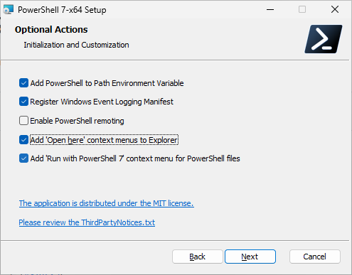
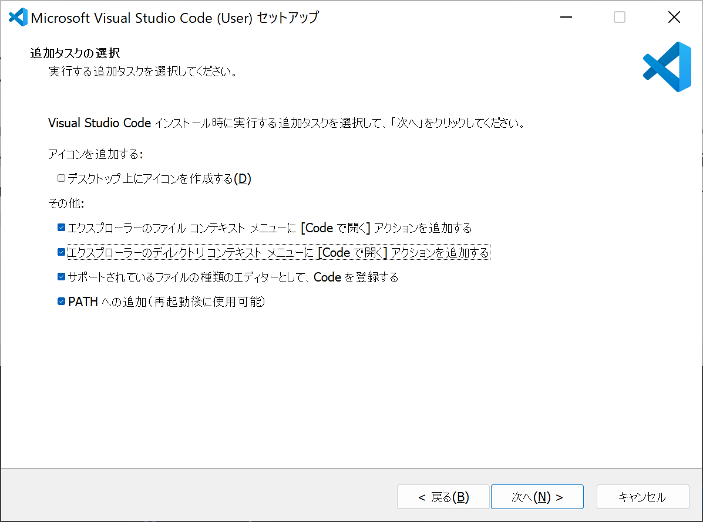
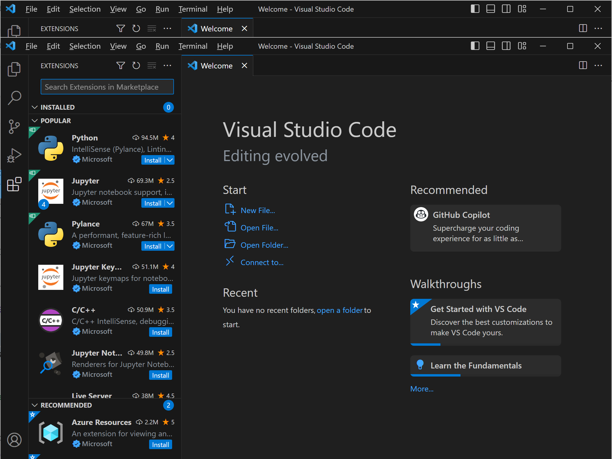

# このハンズオンラボを始めるまえに必要な環境設定


## ハンズオン実施環境
本ハンズオンは、以下の OS で実施することが可能です。
- Windows 11 / 10
- MacOS X
  - BigSur 以上のバージョンでないと、XCode のバージョン非互換で CLI のインストールが出来ない場合があるようです。
- Linux

## Azure Subscription の準備
現状 Azure OpenAI Service へのアクセスは、限られたユーザー様に制限されております。
現在、アクセスが制限されているのは、高い需要、今後の製品改良、マイクロソフトの責任ある AIへのコミットメントを調整するためです。 現在のところ、Microsoft と既存のパートナーシップ関係があるお客様、リスクの低いユース ケース、軽減策の取り入れに取り組んでいるお客様を対象としています。

本ハンズオンの実施にあたり、上記の要件に従い、Azure Subscription を作っていただき、Azure OpenAI へのアクセス権を事前に申請いただく必要があります。

!> 可能であれば、みなさまの所属する会社から払い出しを受けた Azure Subscription をご利用いただくことで、最も早く利用開始可能になります。

会社から Azure Subscription の払い出しを受けるための手順については、所属する企業毎に異なる要件がありますので、まずは社内の IT 担当者やクラウドの担当者の方にご相談ください。
もし、会社から Azure Subscription の払い出しを受けられない場合には、次項にオプションとして、Azure の無償アカウントの作り方を紹介しますので、参考にしてください。

### Azure 無償評価版の作成方法
Azure 無料評価版は、下記のリンクを開いた先にある「無料で始める」というリンクから手続きを進めることで利用開始が可能です。

[Azure の無料アカウントを今すぐ作成する | Microsoft Azure](https://azure.microsoft.com/ja-jp/free/)

無料アカウントの作成には以下の情報が必要ですので、それぞれご用意ください。

- Microsoft アカウント
  - Outlook.com のメールアドレスを利用するか、もしくは任意のメールアドレスを Microsoft アカウントとして登録してご利用ください。
  - もし Microsoft アカウントをお持ちでなければ、[account.microsoft.com](https://account.microsoft.com/) にアクセスして、新規の Outlook.com のメールアドレスを取得ください。
- 有効なクレジットカード
  - 無料の範囲内で利用する場合でも、必ず登録が必要な項目です。
  - お手数ですが有効なクレジットカード情報の登録をよろしくお願いします。
  - 通常は、無償枠が完了した時点で一旦アカウントが停止されるようになっていますが、その制限を外すことも出来るので、アカウントの操作時にはご注意ください。
- 有効な電話番号
  - 個人認証のために有効な電話番号の登録も必要です。
  - SMS もしくは機械音声による通話にて、アカウント発行の途中で個人認証を実施します。

## Azure OpenAI Service へのアクセス申請
Azure の Subscription の準備が出来たら、[Azure OpenAI の利用申請](https://customervoice.microsoft.com/Pages/ResponsePage.aspx?id=v4j5cvGGr0GRqy180BHbR7en2Ais5pxKtso_Pz4b1_xUOFA5Qk1UWDRBMjg0WFhPMkIzTzhKQ1dWNyQlQCN0PWcu)を実施ください。

この申請の際には、ご利用中の Azure Subscription の情報が必要になります。
先述の通り、この手順にて、企業のアカウントに紐づく形で払い出しされた Azure Subscription の情報を入力いただくことで、最も迅速な利用開始が可能になります。
それ以外の Azure Subscription を登録いただいた場合、申請が迅速に受理されない場合がありますので、ご注意ください。

!> 正しく企業アカウントで申請をいただいた場合、承認に要する時間は凡そ 1 営業日以内になる場合が多いです（筆者個人の過去の経験則であり、公式情報ではありません。）

## Azure CLI の準備
### Azure CLI のインストール
Azure CLI のインストール方法は、OS によって様々です。
詳細については[Azure CLI をインストールする方法](https://learn.microsoft.com/ja-jp/cli/azure/install-azure-cli) のドキュメントを確認いただき、自身の利用されている OS に合った方法でセットアップをお願いします。

Azure CLI をインストールする方法

https://learn.microsoft.com/ja-jp/cli/azure/install-azure-cli

インストールが完了したら、コマンドプロンプトや PowerShell や bash など、シェルを立ち上げて下記のコマンドを入力して、期待通りの応答が得られるか確認しましょう。

```cmd
> az -v
```

```出力結果
azure-cli                         2.51.0

core                              2.51.0
telemetry                          1.1.0

Dependencies:
msal                            1.24.0b1
azure-mgmt-resource             23.1.0b2

Python location 'C:\Program Files\Microsoft SDKs\Azure\CLI2\python.exe'
Extensions directory 'C:\Users\user\.azure\cliextensions'

Python (Windows) 3.10.10 (tags/v3.10.10:aad5f6a, Feb  7 2023, 17:20:36) [MSC v.1929 64 bit (AMD64)]

Legal docs and information: aka.ms/AzureCliLegal


Your CLI is up-to-date.
```

### Azure CLI にログイン
Azure CLI が利用可能になったら、操作対象の環境にログインします。
以下のコマンドを入力すると、ブラウザーでのログインを求められるので、有効な資格情報を入力すれば CLI へのログインが完了します。

```bat
> az login
```

すると、利用可能なサブスクリプションのリストが表示されますので、今回利用するサブスクリプションを見つけ "name" の項目と、"id" の項目をメモします。

```出力結果
]
  {
    "cloudName": "AzureCloud",
    "homeTenantId": "<GUID>",
    "id": "<GUID>",
    "isDefault": false,
    "managedByTenants": [
      {
        "tenantId": "<GUID>"
      }
    ],
    "name": "ここにサブスクリプション名が入っているはずです",
    "state": "Enabled",
    "tenantId": "<GUID>",
    "user": {
      "name": "tokawa@microsoft.com",
      "type": "user"
    }
  }
]
```

なお、サブスクリプションのリストを見逃してしまった場合には、以下のコマンドで表形式で表示も可能です。

```bat
>  az account list --output table --query "[].[name,id]"
```

利用するサブスクリプションを選択するためのコマンドは以下の通りです。

```bat
> az account set --subscription サブスクリプション名
```

これで、コマンドラインツールから Azure の操作が出来るようになりました！

## Azure Developer CLI の準備
### Azure Developer CLI のインストール
Azure Developer CLI (azd) のインストール方法も、OS によって様々です。
詳細については「[Azure Developer CLIをインストールまたは更新する](https://learn.microsoft.com/ja-jp/azure/developer/azure-developer-cli/install-azd?tabs=winget-windows%2Cbrew-mac%2Cscript-linux&pivots=os-windows)」のドキュメント確認して、お使いの OS にあわせた方法でインストールを行ってください。

Azure Developer CLIをインストールまたは更新する

https://learn.microsoft.com/ja-jp/azure/developer/azure-developer-cli/install-azd?tabs=winget-windows%2Cbrew-mac%2Cscript-linux&pivots=os-windows

インストールが完了したら、設定反映のために一回ターミナルを再起動してからこの先の手順を進めてください。

### Azure Developer CLI へのログイン
Azure Developer CLI (azd) のセットアップが完了したら、ターミナルを開いて以下のコマンドを実行し、Azure 環境にログインします。

```bat
> azd auth login
```

Azure CLI のログイン時と同じように、ブラウザーが自動的に立ち上がり認証を促されますので、Azure へのアクセス権のあるユーザーにてログインを行ってください。

### Azure Developer CLI の初期設定
azd セットアップ後のターミナル再起動が完了したら、以下のコマンドを実行し、操作対象のサブスクリプションを指定しつつ動作確認します。

```bat
azd config set defaults.subscription サブスクリプションID
```
!> サブスクリプション ID は、先ほど Azure CLI のセットアップ時にメモした id の値 (GUID) を入力します

## Python のインストール
今回のハンズオンでは、Python 3.9 で書かれたサンプルコードを利用します。（最新版にまだアップデートできておらずすみません！）

[Python のダウンロードサイト](https://www.python.org/downloads/)から、お使いの OS に合った Python 3.9 系のインストーラーをダウンロードしてきて、インストールしてください。


Download Python | Python.org<br>
https://www.python.org/downloads/

## Node.js のインストール
今回のハンズオンでは、Node.js で書かれたサンプルコードも利用します。

[Node.js のダウンロードサイト](https://nodejs.org/en/download) からお使いの OS にあった Node.js 最新版のインストーラーをダウンロードしてインストールしてください。

Downloads | Node.js<br>
https://nodejs.org/en/download

## Git CLI のインストール
今回のハンズオンではサンプルソースコードのダウンロードに Azure Developer CLI の機能を利用しますが、その内部で Git CLI が利用されているためインストールが必要です。

[Git CLI のダウンロードサイト](https://git-scm.com/downloads) からお使いの OS にあわせた Git CLI のバージョンをダウンロードしてインストールしてください。

> インストール時に色々聞かれますが、基本的には全てデフォルト設定で問題ないはずです。

## PowerShell 7 のインストール
Windows 環境でハンズオンを実施中の方は、PowerShell 7 のセットアップも必要です、

[PowerShell 7 のダウンロードサイト](https://github.com/PowerShell/PowerShell/releases/tag/v7.3.6) よりインストーラーをダウンロードして、インストールしてください。

PowerShell<br>
https://github.com/PowerShell/PowerShell/releases/tag/v7.3.6

インストール途中に出てくる下記ダイアログの、下二つのチェックは入れておくとコンテキストメニューから PowerShell を開けるようになっておススメです。


## .NET SDK のインストール
今回のハンズオンのサンプルソースコードに、.NET 7.0 ベースのソリューションが含まれているためインストールが必要です。

[.NET 7 のダウンロードサイト](https://dotnet.microsoft.com/ja-jp/download/dotnet/7.0) より最新の SDK をダウンロードしてインストールしてください。

.NET SDK<br>
https://dotnet.microsoft.com/ja-jp/download/dotnet/7.0

## Visual Studio Code の準備
### Visual Studio Code のインストール
まずは[Visual Studio Code のダウンロードサイト](https://code.visualstudio.com/download)から、ご利用されている OS にあわせた Visual Studio Code をダウンロードし、インストーラーを実行してインストールします。

Download Visual Studio Code

https://code.visualstudio.com/download

> VS Code のセットアップ時に、以下の追加タスクのダイアログの、上二つのチェックボックス（[Code で開く] アクションを追加する）にチェックを入れておくと、あとから VS Code を開くときに楽になりますのでおススメです。



### Visual Studio Code に Extensions をインストールする
VS Code への Extensions のインストールは、VS Code 起動後のサイドバーにある "Extensions" のアイコンから行います。
下記スクリーンショットの赤枠で囲んだアイコンです。



"Search Extensions in Marketplace" のテキストボックスから、名前検索が出来ますので、以下にリストした Extensions を探してインストールしてください。

- Python
- Python Extension Pack
- Azure Tools
  - Azure Tools のセットアップ途中で、azd のセットアップや Azure へのログインなど求められますが、以下 2 点進めて、あとは一番下の "Mark Done" をクリックして完了させてしまって構いません。
- C#

完了したら、VS Code にフォーカスを当てた状態で <kbd>F1</kbd> キーを押して、"reload" と検索し "Developer: Reload Window" を実行し、VS Code に先ほどインストールしたプラグインが正しく読み込まれるようにしてください。

# 補足情報
## VS Code で Python を利用可能にするところまでのトレーニング
Microsoft Learn に VS Code に Python をセットアップする部分をまとめた技術トレーニングがありました。
こちらも是非参考にしてみてください。

Visual Studio Code で Python を使ってみる

https://learn.microsoft.com/ja-jp/training/modules/python-install-vscode/