# Azure OpenAI を使うための初期設定

## 前提条件
この手順を実施する前に、[事前準備](step0.md)として以下の条件を満たしている必要があります。
- 所属する会社から払い出しを受けるか、個人のクレジットカードにて有効化済みの、有効な Azure Subscription を持っている
- 利用する Azure Subscription で Azure OpenAI の利用申請が完了している

## Azure OpenAI のアカウントを作成する
[Azure Portal](https://portal.azure.com/) にログインし、左上のハンバーガーメニュー（横３本線のアイコン）を展開し、リソースの作成ボタンをクリックします。

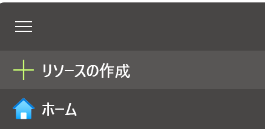

MarketPlace の画面が開きますので、左上の検索窓から "Azure OpenAI" と検索して、検索結果に Azure OpenAI が出てくることを確認します。

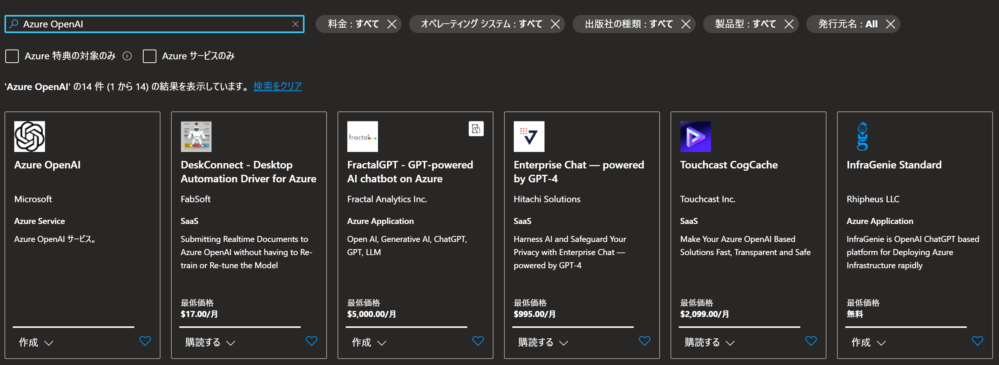

検索結果の左下にある「作成」ボタンをクリックし、そこから展開される "Azure OpenAI" をクリックします。
すると次に "Azure OpenAI の作成" という画面が表示されますので、必要な情報を入力します。

一般的には、以下のような形で入力することになるかと思います。

- サブスクリプション
  - Azure OpenAI を利用しようとしている Azure Subscription 名を選択
- リソースグループ
  - 任意の一意の名前を入力
- リージョン
  - Azure OpenAI を利用したいリージョンを選択
    - 現状、EastUS が一番多くのモデルを利用できる一方、ChatGPT であれば JapanEast が一番応答は早いと思います。
  - 名前
    - 任意の一意の名前を入力
  - 価格レベル
    - Standard S0 を選択

「次へ」をクリックし、「ネットワーク」の画面では今回、「インターネットを含むすべてのネットワークがこのリソースにアクセスできます」を選択します。
!> ここで他のオプションを選択することで、例えば Azure 上にある Web サーバーからの呼び出しのみ許可する形のように、限られたネットワークの範囲からのみのアクセスを許可するような構成も可能です。

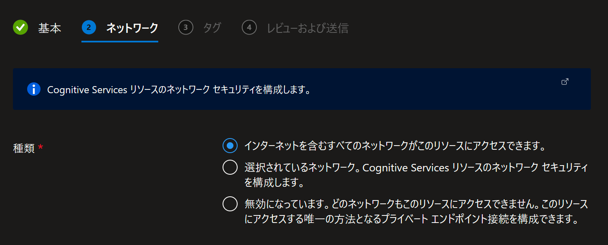

残りの画面は「次へ」で飛ばしていただき、「レビューおよび送信」の画面まで行ったら「作成」ボタンを押してください。

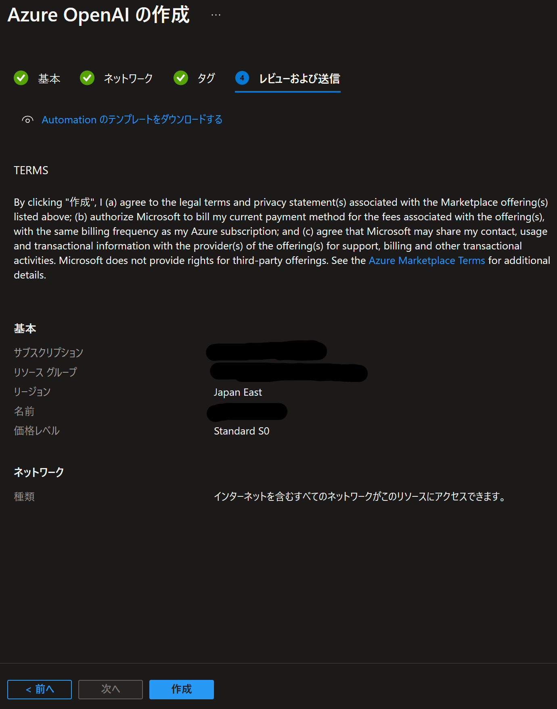

デプロイ状況の確認画面が表示されますので、ステータスが完了になるのを待機します。

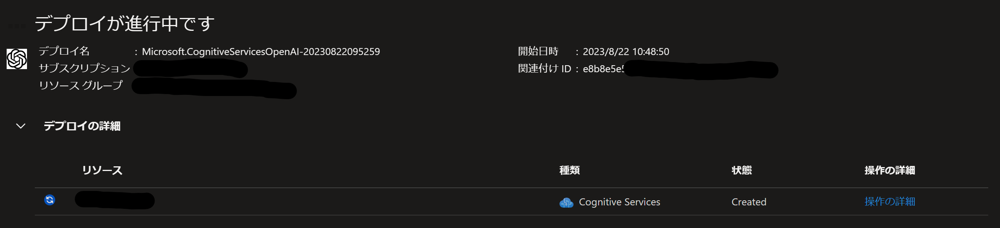

以下の画面が出たら、Azure OpenAI のリソースの作成は完了です。

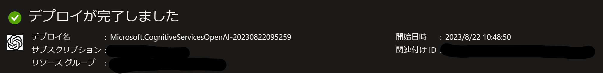
## Azure OpenAI のアカウントが作成されたことを確認する
一旦、[Azure Portal](https://portal.azure.com/) に戻り、画面上部の検索窓で "Azure OpenAI" と検索します。

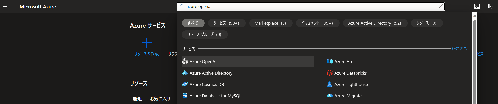

検索結果から、”Azure OpenAI” を探してクリックします。
すると、サブスクリプションにデプロイされている Azure OpenAI のアカウントのリストが表示されます。

その中に、先ほど作ったものがあることを確認してください。

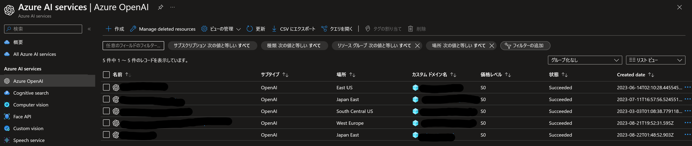

先ほど作った OpenAI の名前の部分をクリックし、OpenAI の管理画面に移行します。

## Azure OpenAI の Azure Portal 側の管理画面
Azure OpenAI の Azure Portal 側の管理画面は下記のような形で表示されます。
（Azure Portal 側の、と称しているのは、実はこの後に別の URL でホストされる専用の別のポータルも使うからです）

左ペインに各種メニューがあり、右ペインもしくは別画面にて詳細な情報の確認もしくは操作を実施するような形です。

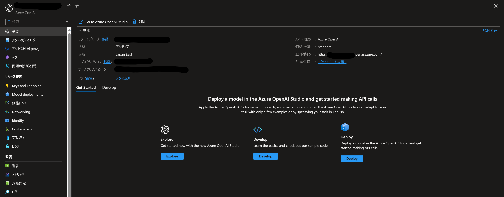

### Azure OpenAI の管理画面のメニュー項目について
Azure Portal にある Azure OpenAI の管理画面にて実行できる操作（主な左ペインのメニューの項目）についてここで解説します。

- 概要
  - この画面には Azure OpenAI の エンドポイントの URL や、デプロイ名やデプロイされているリージョンなどの情報がまとまっています。
- Keys and Endpoint
  - この画面から Azure OpenAI にアクセスするのに必要なキーの情報を取得します
- Model deployments
  - この画面から Azure OpenAI のモデルデプロイ画面に移行します
- Networking
  - この画面から、対象の Azure OpenAI にアクセス可能なネットワークの設定が可能です。

## Azure OpenAI のモデルをデプロイする
モデルのデプロイは、専用のポータル [Azure OpenAI Studio](https://oai.azure.com/) にて行う必要があります。
前節で紹介した Azure Portal にある Azure OpenAI の管理画面の "Model deployments" のメニューから、Azure OpenAI Studio へ移動します。

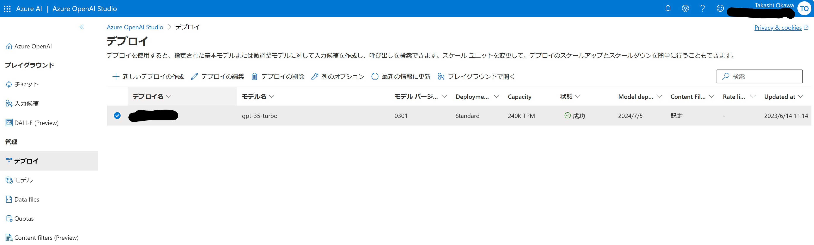

表示された画面から「デプロイ」を選択し、画面から「＋新しいデプロイの作成」のメニューを見つけてクリックします。

すると、下記のような「モデルのデプロイ」の画面が表示されますので、利用したいモデルを選択し、また任意のデプロイ名を指定します。
このデプロイ名は、今後プログラムなどから Azure OpenAI のリソースにアクセスする際に必要になりますのでメモをするか、OpenAI Studio にいつでもアクセスできるようにしておくとよいでしょう。

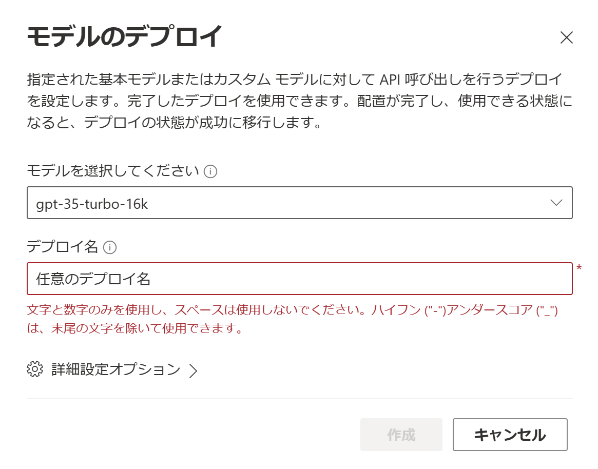

このワークショップでは、次の手順で使うために "gpt-35-turbo-16k" もしくは "gpt-35-turbo" を選択してモデルをデプロイください。
また、他の人とサブスクリプションを共有する場合には、「詳細設定オプション」も開いて、"Tokens per Minute Rate Limit (thousands)" の値を調整してください。
（あまり派手に使わなければ、30K もあれば充分かと思います…）

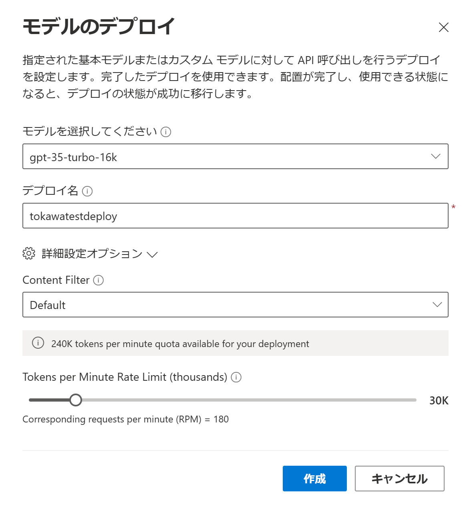

### 複数人でサブスクリプションを分割して使っているときの Tips
複数人で同じサブスクリプションを使っている場合、１分間当たりのトークン数の制限 (TPM) に引っかかる場合にはエラーが発生しモデルがデプロイできなくなります。
その場合には、Azure OpenAI Studio の「デプロイ」の画面から、TPM が多く割り当てられているデプロイを探し、その名前をクリックしてください。

遷移した画面で「デプロイの編集」ボタンをクリックすると、「デプロイの編集」ウィンドウが開き、そこの「詳細設定オプション」から割り当てる TPM を変更できます。
他の人と共有しても問題の無い程度の TPM によしなに調整していただければ幸いです。

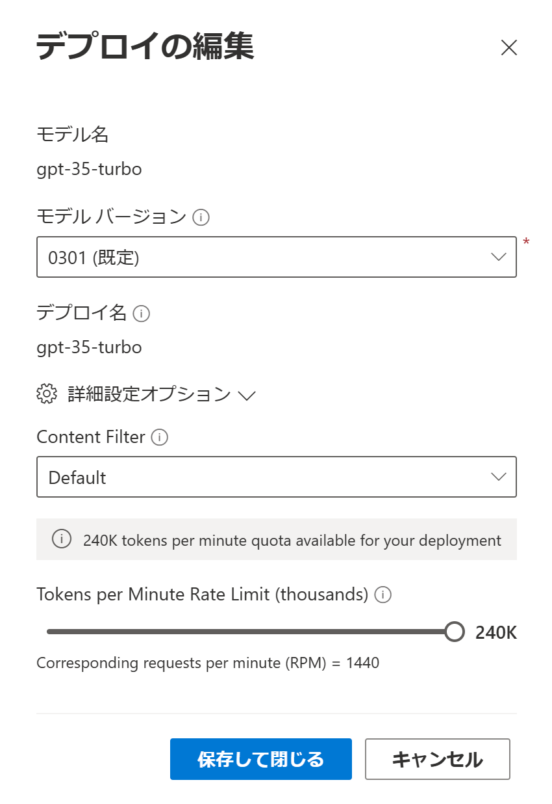

# おめでとうございます！
これで、自分のサブスクリプションに、自由に安全に使える OpenAI のデプロイが完了しました！