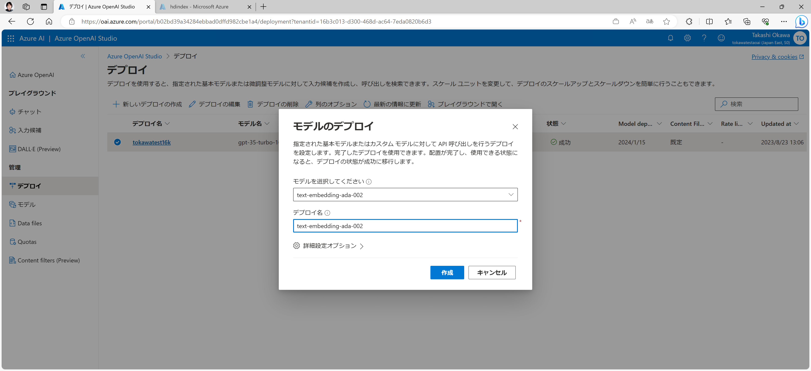

# Azure OpenAI に自前のドキュメントを組み込む
## 前提知識
### OpenAI にデータを足すためのアプローチについて
GPT の回答はあくまでも GPT が知り得る範囲の情報から尤もらしい答えを応答しているに過ぎないことは周知の事実かと思います。
従って、GPT に最新のデータや業務データ等の外部に公開されていないデータを考慮した回答をしてほしい場合には、何らかの方法で GPT にそれらの情報をコンテキストとして教える必要があります。

一方、GPT に教え込みたいデータが大量にあった場合には、GPT が一度に扱えるトークン数の上限がありますので、そのトークン数を超過しないようにコンテキストに含めるデータの量を加減しなければいけません。

この、大量のデータを教え込みたい、という要望と、GPT の扱えるトークン数の制約を両立するためのアプローチとして、以下のような方向性で進めることが可能です。

- 長い文章については、文章を短く区切り、GPT にコンテキストとして与えやすい形にする
- ユーザー入力をキーとしてデータベースを検索可能にし、教え込みたいデータのうち回答に必要と思われる部分だけを GPT のコンテキストに与えられるようにする

Microsoft では、このアプローチの概念検証コードとして、GitHub から簡単にデプロイできるようなものをご提供しています。

azure-open-ai-embeddings-qna
https://github.com/Azure-Samples/azure-open-ai-embeddings-qna

今回は、この [azure-open-ai-embeddings-qna](https://github.com/Azure-Samples/azure-open-ai-embeddings-qna) のサンプルを実際にデプロイして、ドキュメントが検索可能となることを試してみます。

## デプロイ手順
### Azure OpenAI の事前準備
ひとつ前の手順で利用した Azure OpenAI のアカウントを流用する形で OK ですが、今回のサンプルは Embedding も使うため、新たなモデルのデプロイが必要です。
[Azure OpenAI Studio](https:/oai.azure.com) から、モデルのデプロイの管理画面（左ペインから「デプロイ」を選択）を開いて「新しいデプロイの作成」で "text-embedding-ada-002" を "text-embedding-ada-002" という名前でデプロイします。

ここで書いてある「デプロイ名」はそれぞれ