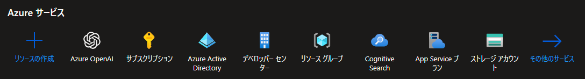
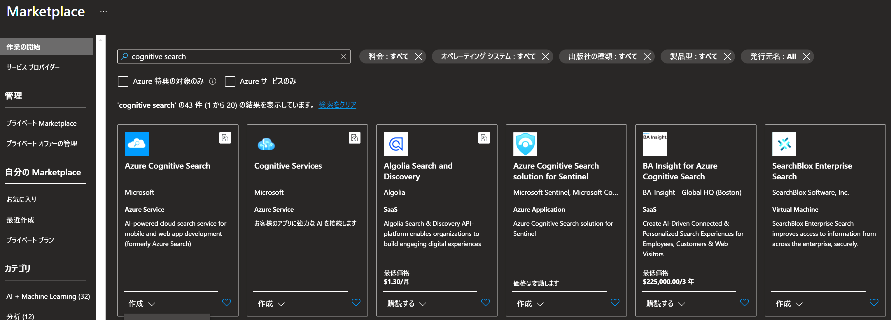
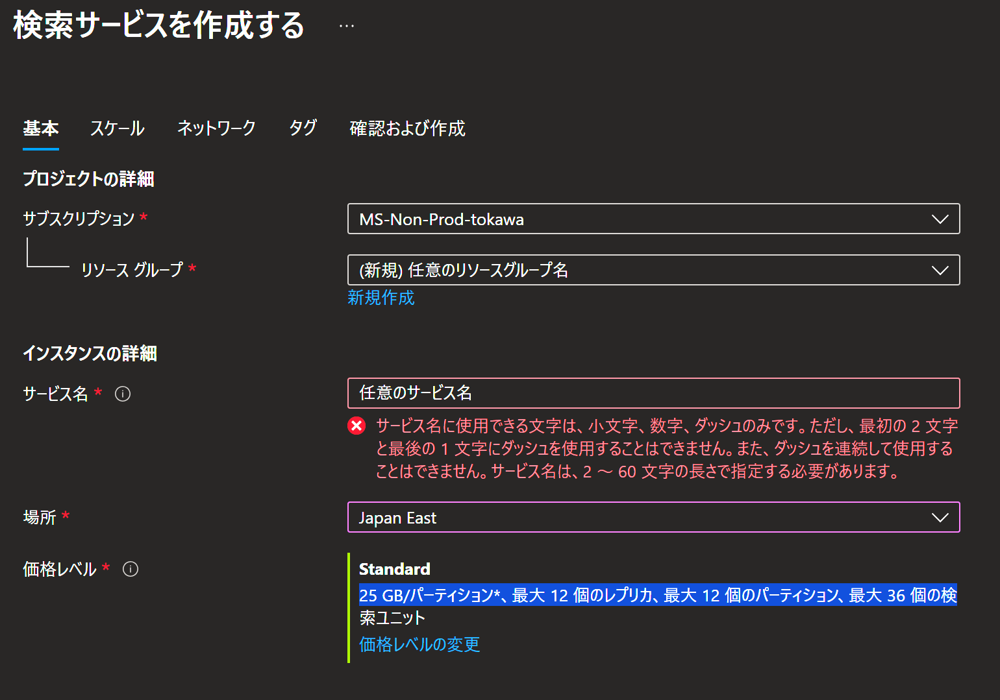

# Azure OpenAI に自前のドキュメントを組み込む
## 前提知識
### add your data 機能について軽く解説
GPT の回答はあくまでも GPT が知り得る範囲の情報から尤もらしい答えを応答しているに過ぎないことは周知の事実かと思います。
従って、GPT に最新のデータや業務データ等の外部に公開されていないデータを考慮した回答をしてほしい場合には、何らかの方法で GPT にそれらの情報を教える必要があります。

add your data 機能はそのシンプルなアプローチの一つです。
この機能を使うことで、簡単に自前のデータを GPT に接続し、GPT が本来知りえなかった情報を根拠にした結果を得ることが可能になります。

### add your data 機能の日本語対応状況について
この便利そうに見える on your data 機能ですが、残念ながらまだ開発中の機能のため、日本語に正式に対応していません。
そのため、一番シンプルな、OpenAI Playground からデータを追加する方法で実施した場合、内部的に使われる Cognitive Search のインデックスが英語設定になってしまったりして、意図通りの結果を得られません。

そのうち開発が進めばこの点も改善することと思いますが、いまのところはもう少し手の込んだ方法でデータを足してやる必要があります。
具体的な手順についてはこの後で説明します。

### いまのところやらなければいけないこと
いまのところ実施しなければいけないことは以下の 2 点です。

- 入力のドキュメントを適切な形でチャンク分けする
- Cognitive Search のインデックスを日本語で作成する

これらの作業から、追加データのチャンキングの大切さや Cognitive Search の使いかたなど、OpenAI にデータを繋ぐうえで大切なポイントについてもご理解いただけたら幸いです。

## on your data を試してみる
### on your data で利用するデータについて
on your data で利用するデータについては、自前でインデックスを作る場合、最終的にテキスト形式に落とし込めればどんな形式でも問題ありません。

### Azure Cognitive Search を作る
まずは、追加するデータを検索可能にするために、[Cognitive Search](https://learn.microsoft.com/ja-jp/azure/search/search-what-is-azure-search) というリソースを作ります。
Azure Cognitive Search は、Web、モバイル、エンタープライズ アプリケーションに、プライベートで異種のコンテンツに対するリッチな検索エクスペリエンスを組み込むためのインフラストラクチャ、API、およびツールを開発者に提供するクラウド検索サービスです。

Cognitive Search を作成するには、まずは [Azure Portal](https://portal.azure.com) のトップページから、「リソースの作成」を行います。

Azure OpenAI を作ったときと同じように、マーケットプレースで "Cognitive Search" と検索し、Cognitive Search の「作成」を開始します。

基本設定画面では、以下の様に情報を入力します。

- サブスクリプション : Azure OpenAI と同じサブスクリプション
- リソースグループ : 任意の名前
  - Azure OpenAI と同じ名前のリソースグループに入れておくと、あと片付けが一発で終わるのでおススメです。
- サービス名 : 任意のサービス名
- 場所 : Japan East など利用する場所から近いリージョンを選択
- 価格レベル : Standard

入力が終わったら「確認及び作成」ボタンを押して、最終確認画面に遷移します。
ここでデプロイ内容の確認が終わったら「作成」ボタンをクリックして Cognitive Search を作成します。

### 入力するドキュメントをチャンク分けする
ここが、ChatGPT が長文の参考文献を利用する際に重要な要素となります。なぜ適切なチャンク分けが必要かというと、ChatGPT などの LLM は、利用できるトークン数の範囲内でしか In-Context な学習を行えないためです。

- あまりにも長い文章を学習データとして与えると、学習データだけで利用できるトークン数を超過してしまう。
- 一方、チャンクを適当に切ると、含めるべき文章が全て含まれない形の文章の断片がコンテキストに含まれなくなってしまう。

従って、チャンク分割を適切に実施することで、LLM が利用できるトークン数の範囲内で、充分にコンテキストに知識を与えることが大切なわけです。

チャンク分けをするアプローチは色々あって、ここが実はエンジニアの腕の見せ所でもあります。
例えば意味段落ごとにチャンクを作ったり、隣り合った似た知識をオーバーラップさせる形でチャンクを切ったり、と工夫が色々と出来るポイントです。
ただ、今回はハンズオンの時間に限りもあり、あまり長時間かけられないため、入力された文章を指定したトークン上限を超えない範囲で機械的に切るアプローチで進めます。

### Cognitive Search に日本語のインデックスを作る
チャンク分けしたドキュメントをもとに日本語インデックスを Cognitive Search に作成する。

### 出来たインデックスを Azure OpenAI Studio から接続する
on your data で接続する。

### 試してみる
まずは Playground で試してみる。

### 企業向け GPT のサンプルをデプロイしてみる
WebApp をデプロイしてみる。