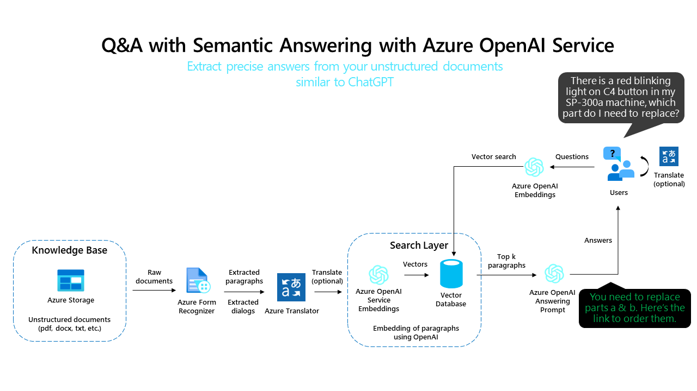
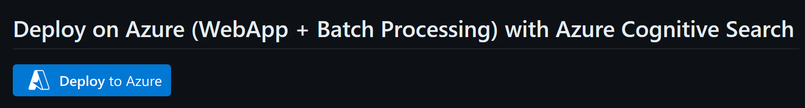
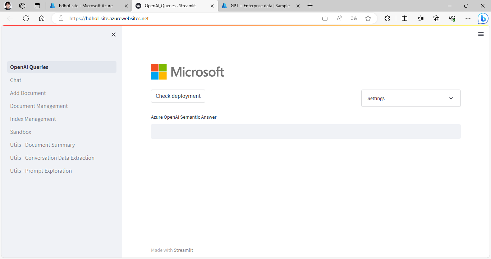
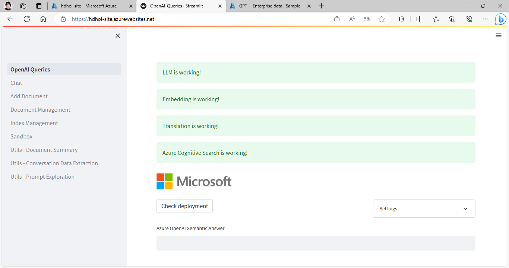
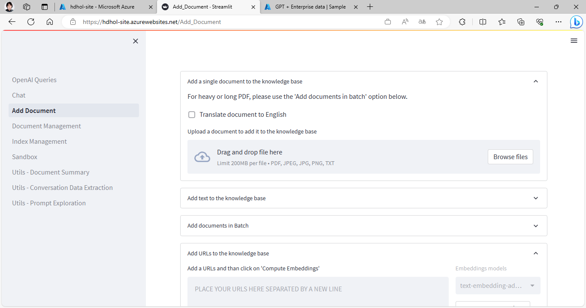
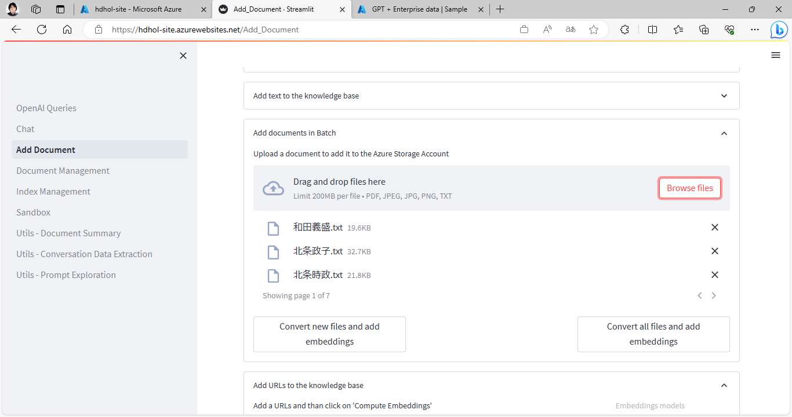
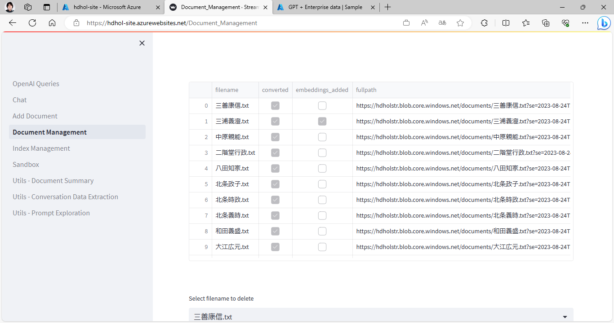
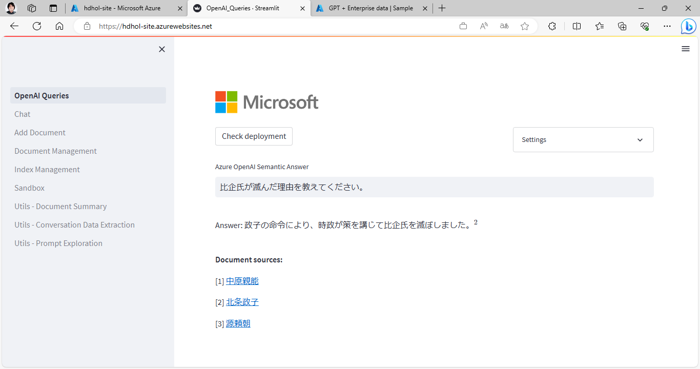

# Azure OpenAI に自前のドキュメントを組み込む
## 前提知識
### OpenAI にデータを足すためのアプローチについて
GPT の回答はあくまでも GPT が知り得る範囲の情報から尤もらしい答えを応答しているに過ぎないことは周知の事実かと思います。
従って、GPT に最新のデータや業務データ等の外部に公開されていないデータを考慮した回答をしてほしい場合には、何らかの方法で GPT にそれらの情報をコンテキストとして教える必要があります。

一方、GPT に教え込みたいデータが大量にあった場合には、GPT が一度に扱えるトークン数の上限がありますので、そのトークン数を超過しないようにコンテキストに含めるデータの量を加減しなければいけません。

この、大量のデータを教え込みたい、という要望と、GPT の扱えるトークン数の制約を両立するためのアプローチとして、以下のような方向性で進めることが可能です。

- 長い文章については、文章を短く区切り、GPT にコンテキストとして与えやすい形にする
- ユーザー入力をキーとしてデータベースを検索可能にし、教え込みたいデータのうち回答に必要と思われる部分だけを GPT のコンテキストに与えられるようにする

Microsoft では、このアプローチの概念検証コードとして、GitHub から簡単にデプロイできるようなものをご提供しています。

azure-open-ai-embeddings-qna
https://github.com/Azure-Samples/azure-open-ai-embeddings-qna

今回は、この [azure-open-ai-embeddings-qna](https://github.com/Azure-Samples/azure-open-ai-embeddings-qna) のサンプルを実際にデプロイして、ドキュメントが検索可能となることを試してみます。

### アーキテクチャ解説

今回デプロイするアーキテクチャは上記の画像のようなものです。
アーキテクチャのポイントを以下にまとめてみましたので、読み解くための参考にしてください。

- Azure Storage にグラウンディング用の原盤データはアップロードされます
- Form Recognizer を使って、入力されたドキュメントがテキストデータ化され、また必要であれば翻訳されます
- その後 Embedding の機能を使って、入力されたドキュメントを Embedding Vector 化して、Vector Database に保存します
  - これで、入力データが検索可能な状態となります
- Web UI から入力された質問を、Embedding でベクトル化し、先ほど作った Vector Database に対してベクトル類似度の検索を実行して、ユーザーの質問に近いドキュメントを探し出します
- 探し出したドキュメントをコンテキストに加えて、ChatGPT のモデルがよしなに出力の内容を成形して表示します

## デプロイ手順
### Azure OpenAI の事前準備
ひとつ前の手順で利用した Azure OpenAI のアカウントを流用する形で OK ですが、今回のサンプルは Embedding も使うため、新たなモデルのデプロイが必要です。
[Azure OpenAI Studio](https:/oai.azure.com) から、モデルのデプロイの管理画面（左ペインから「デプロイ」を選択）を開いて「新しいデプロイの作成」で "text-embedding-ada-002" を "text-embedding-ada-002" という名前でデプロイします。

ここで設定した、gpt35-turbo-16k ならびに text-embedding-ada-002 の「デプロイ名」はそれぞれ今後の手順で利用しますので、どこかにメモをしておきましょう。
また、このモデルをデプロイした Azure OpenAI のアカウントの「名前」と「キー」も必要になりますので、これは Azure Portal の OpenAI の管理画面から取得してメモしておきましょう。

### Deploy to Azure ボタンを利用したデプロイ
このサンプルは、[Deploy to Azure](https://learn.microsoft.com/ja-jp/azure/azure-resource-manager/templates/deploy-to-azure-button) ボタンという機能を利用して、GitHub にあるコードとインフラをまとめてデプロイすることが出来るようになっていますのでそれを活用します。

!> 勿論、Deploy to Azure の機能は誰にでも使っていただけますので、例えば自社のアプリの基本環境のデプロイを Deploy to Azure で自動化することで、似たような環境の大量生産が可能です。

[azure-open-ai-embeddings-qna](https://github.com/Azure-Samples/azure-open-ai-embeddings-qna#deploy-on-azure-webapp--batch-processing-with-azure-cognitive-search) のリポジトリに移動すると、"Deploy on Azure (WebApp + Batch Processing) with Azure Cognitive Search" という項目の下に、青色の "Deploy to Azure" ボタンがみつかると思いますので、そちらをクリックします。

!> もう一つ異なる環境をデプロイする "Deploy to Azure" ボタンがありますので、"Deploy on Azure (WebApp + Batch Processing) with Azure Cognitive Search" という項目のものかご注意ください。

Deploy to Azure ボタンをクリックすると、Azure Portal にログインした後に以下のようなテンプレートの変数設定画面に移行します。

それらの中から、以下の表にある入力項目を探して設定します。それ以外のものは何か入っているものも消さず、空欄のところはあけておく形で、触らないでください。

!> 一番気を付けなければいけないのが "Open AI Deployment Type"　は規定値で Text と入っているところを Chat に置き換える必要があるところです。

|  項目名  |  設定値  |  例  |
|  ----  | ---- | ---- |
|  リソースグループ  |  任意の値を「新規作成」から入力してください  |  MyAzureHandson-rg  |
|  リージョン  |  任意のリージョンを選択してください。今回は Japan East がおススメです。  |  Japan East  |
|  Resource Prefix  |  リソース名が他の人と被らないようにするためのユニーク値なので、任意のユニークな短い値を設定しましょう。  |  TOkawa0123  |
|  Open AI Name |  Portal から事前作成した Azure Open AI の名前を入力します  |  tokaawaholaoai  |
|  Open AI Key  |  Portal から事前作成した Azure Open AI のアクセスキーを入力します  |  abc1ad.....  |
|  Open AI Engine  |  事前にデプロイした davinch,GPT35,GPT35-16k,GPT4 などのモデルのデプロイ名  |  GPT-35-Turbo-16K  |
|  Open AI Deployment Type  |  ここは、GPT35, GPT4 のモデルを使っている場合には Chat に変える必要があります  |  Chat  |
|  Open AI Embeddings Engine Doc  |  事前にデプロイした text-embedding-ada-002 のモデルのデプロイ名   |  text-embedding-ada-002  |
|  Open AI Embeddings Engine Query  |  事前にデプロイした text-embedding-ada-002 のモデルのデプロイ名  |  text-embedding-ada-002  |

設定が終わったら、画面下部にある「次へ」のボタンを押して、構成情報のバリデーションを行います。

問題なくバリデーションが通ったら「作成」ボタンをクリックすることで、環境が Azure 上に自動デプロイされます。

> ちょっと時間がかるので、ここも休憩を挟むのにいいタイミングです。

無事にデプロイが完了すると、ポータルの画面に「デプロイが完了しました」と表示されます。

### Web 画面からアクセスしてみる
デプロイが完了したら、先ほど作ったリソースグループに Azure Portal から移動します。

リソースグループ内のリソースのリスト画面から、「種類」が "App Service" であるものを探してその名前をクリックします。すると、Web アプリの情報が表示されますので、画面右上の方にある「既定のドメイン」のリンクをクリックします。

このリンク先が、先ほど自動デプロイされた、サンプルのアプリケーションの Web UI となります。初回の起動には多少時間がかかりますが、根気強くお待ちください。

この画面が表示されたら、一旦コードのデプロイには成功しています。

必要なリソースへのアクセスまで含めた設定が成功しているか確認するため、"Check Deployment" ボタンをクリックします。

!> 先ほどのデプロイメントテンプレートの設定を間違えていると、ここでエラーになります。その場合、環境変数を書き換えて修正していく必要がありますが、わからなかったらリソースグループを丸ごと削除してもう一度デプロイからやり直しましょう。

このような感じで、全てのリソースへのアクセスが "... is working!" という表示で確認出来たら、このシステムは正常に作動していると分かります。

### Web 画面からデータを投入する
このサンプルでは、あとからデータを投入する機能も実装されているので、それを試してみましょう。
左ペインから、"Add Document" をクリックし、データ投入画面を開きます。

この画面の上部にある、"Drag and drop file here" にサポートされた形式のファイルを落とすことで、データの登録が可能です。
なお、まとめてデータを登録したい場合には、"Add documents in Batch" から登録も可能なので、ご活用ください。

とりあえず先ほども使った鎌倉武将データを投入しても良いですし、皆さんの好きなデータを入れてみても構いません。

> ここでデータの処理に多少時間がかかります。またコーヒーブレイクの時間かもしれません。

### 投入したデータを確認する
ここでは、投入したデータが正常に処理されたかを確認します。

左ペインから "Document Management" を開くと、以下のような画面が出てきます。

登録済みドキュメントのリストが表示されて、全てのファイルの "Converted" と "Embeddings_added" にチェックが入っていればデータの準備は完了しています。
もし、チェックが入っていないものがあれば、データの処理中ですので暫く待ちましょう。

リロードして、全てのチェックが入ったことを確認したら、次の手順に進みましょう。

### Web UI から動作を確認してみる。
左ペインの OpenAI Queries からクエリをかけてみましょう。

鎌倉武将データを入れているようでしたら、たとえば `比企氏が滅んだ理由を教えてください。` とか聞くと、回答が得られると思います。

ちょっとあっさりした回答かもしれませんが、Document Sources として参考ドキュメントを提示してくれており、その内容をまとめて結果を作ってくれていることがわかります。